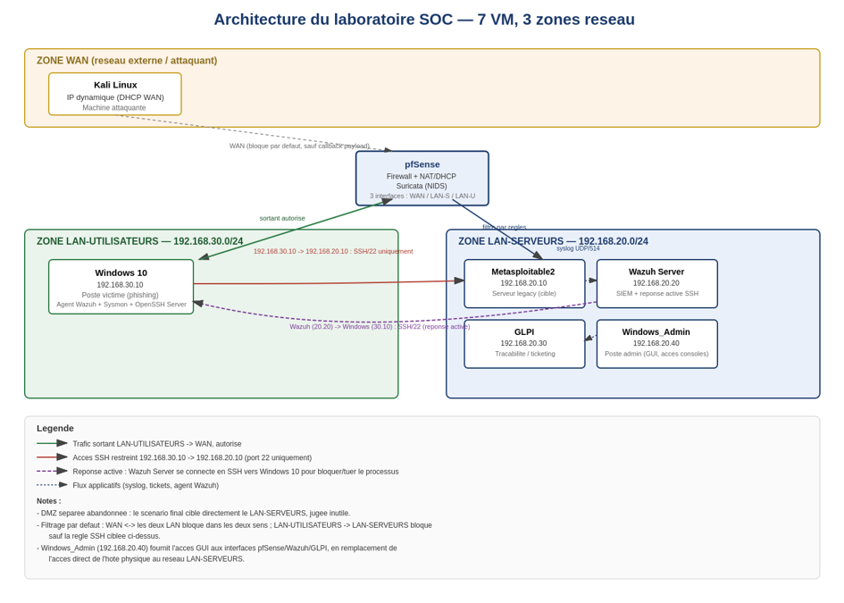

# Architecture

## Vue d'ensemble

Le lab reproduit un environnement d'entreprise segmenté en trois zones réseau, avec un pare-feu central assurant à la fois le filtrage inter-zones et la détection réseau (NIDS). L'objectif : isoler un poste utilisateur compromis (phishing) d'un serveur legacy sensible, tout en centralisant détection, réponse et traçabilité côté SOC.

## Zones réseau

| Zone | Sous-réseau | Contenu |
|---|---|---|
| WAN | — | Poste attaquant (Kali), IP dynamique |
| LAN-UTILISATEURS | 192.168.30.0/24 | Poste victime (Windows 10) |
| LAN-SERVEURS | 192.168.20.0/24 | Metasploitable2, Wazuh Server, GLPI, Windows_Admin |

Il n'y a pas de DMZ séparée. Elle a été envisagée puis abandonnée pour le scénario final : elle ne contenait rien de significatif à protéger, et cibler directement le LAN reflète mieux un scénario réaliste de compromission par phishing.

## Machines virtuelles (7 VM, VMware Workstation)

| VM | Zone | IP | Rôle | OS / Version |
|---|---|---|---|---|
| pfSense | WAN / LAN-UTILISATEURS / LAN-SERVEURS | 3 interfaces | Pare-feu, NAT, NIDS Suricata | pfSense 2.9.0-RELEASE |
| Kali | WAN | dynamique | Poste attaquant | Kali 2025.2 |
| Windows 10 | LAN-UTILISATEURS | 192.168.30.10 | Poste victime (phishing) | Windows 10 |
| Metasploitable2 | LAN-SERVEURS | 192.168.20.10 | Cible legacy (SSH bruteforce) | Metasploitable2 |
| Wazuh Server | LAN-SERVEURS | 192.168.20.20 | SIEM / orchestration réponse active | Wazuh 4.14 sur Ubuntu Server 24.04.4 |
| GLPI | LAN-SERVEURS | 192.168.20.30 | Ticketing / traçabilité | GLPI 11.0.8 sur Ubuntu Server 24.04.4 |
| Windows_Admin | LAN-SERVEURS | 192.168.20.40 | Accès GUI aux interfaces pfSense / Wazuh / GLPI | Windows 10 |

Windows_Admin remplace l'accès direct de l'hôte physique à la zone LAN-SERVEURS. Cet accès direct a été supprimé après la découverte d'une fuite réseau (voir [troubleshooting.md](troubleshooting.md)) : une IP sur la carte hôte virtuelle VMware du VMnet LAN-SERVEURS créait une route parasite exploitable par Kali pour contourner pfSense.

L'IP de Kali n'est jamais codée en dur dans les règles pare-feu ou de détection : elle change régulièrement (allocation dynamique), les règles s'appuient sur des plages/segments plutôt que sur une IP fixe.

## Stack technique complémentaire

| Outil | Version | Détail |
|---|---|---|
| Suricata | 7.0.9 | NIDS intégré à pfSense, ruleset ET Open `emerging-malware.rules` (règle native activée, pas de signature custom) |
| Metasploit Framework | v6.4.64-dev | Génération payload (`msfvenom`/`web_delivery`), gestion du reverse shell |
| OpenSSH | 4.7p1 | Version legacy sur Metasploitable2, justifiant l'abandon de Hydra et du module Metasploit `ssh_login` au profit d'un script bash + `sshpass` (voir [troubleshooting.md](troubleshooting.md)) |

## Filtrage réseau (règles pfSense)

| Source | Destination | Port | Action |
|---|---|---|---|
| WAN | LAN-UTILISATEURS, LAN-SERVEURS | — | Bloqué (les deux sens) |
| LAN-UTILISATEURS | WAN | — | Autorisé (sortant) |
| LAN-UTILISATEURS | LAN-SERVEURS | — | Bloqué par défaut |
| 192.168.30.10 (Windows 10) | 192.168.20.10 (Metasploitable2) | 22 (SSH) | Autorisé — seule exception à la règle précédente |
| 192.168.20.20 (Wazuh) | 192.168.30.10 (Windows 10) | 22 (SSH) | Autorisé — sens inverse, ajouté pour la réponse active (voir [reponse-active.md](reponse-active.md)) |

Cette dernière règle casse la logique de cloisonnement classique LAN-SERVEURS → LAN-UTILISATEURS bloqué, mais reproduit un vrai schéma SOC/SOAR : l'outil de sécurité centralisé reprend la main sur un poste compromis.

## Décisions de conception

- **Pas de DMZ** : jugée inutile pour ce scénario, retirée après retour des instructeurs.
- **Ubuntu Server (pas Desktop)** pour Metasploitable2-cible, Wazuh Server et GLPI ; Desktop conservé uniquement pour Kali et Windows 10, où une interface graphique a un usage réel.
- **Accès au dashboard Wazuh** : exclusivement via tunnel SSH depuis Windows_Admin, jamais depuis Windows 10 (incohérent avec son rôle de victime dans le scénario).
- **pfSense reconstruit une fois** après un crash (corruption ZFS suite à un arrêt brutal) ; repassé en UFS pour éviter la récidive.