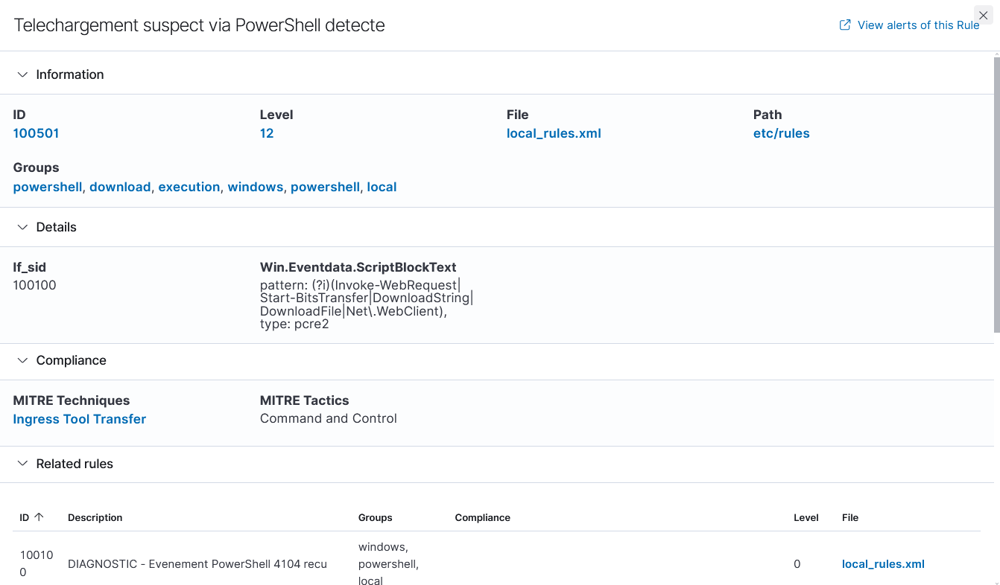
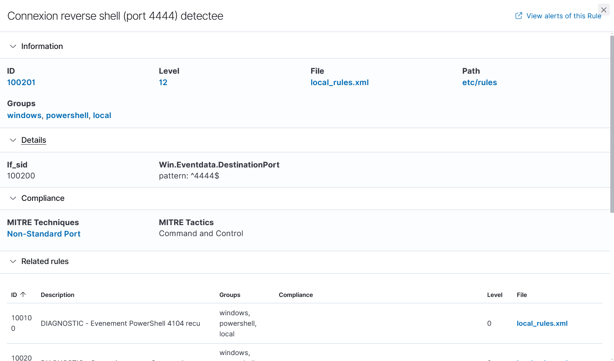
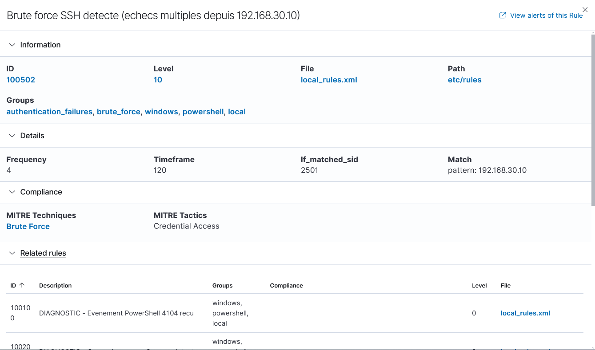
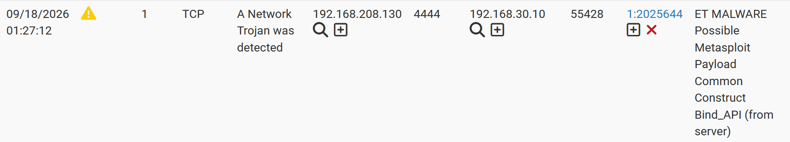
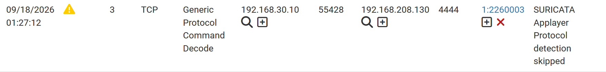

# Détection

Quatre mécanismes de détection couvrent trois des huit étapes du scénario d'attaque (voir [scenario-attaque.md](scenario-attaque.md)) : trois règles Wazuh custom, et deux signatures Suricata convergentes sur le même flux réseau.

| Étape du scénario | Mécanisme | Règle / Signature |
|---|---|---|
| 2 — Téléchargement et exécution du payload | Wazuh (Sysmon/PowerShell) | 100501 |
| 3 — Ouverture du reverse shell | Wazuh (Sysmon Event 3) | 100201 |
| 3 — Ouverture du reverse shell | Suricata (signature) | SID 2025644 |
| 3 — Ouverture du reverse shell | Suricata (heuristique) | SID 2260003 |
| 7 — Brute force SSH | Wazuh (fréquence) | 100502 |

## Wazuh — règles custom (`local_rules.xml`)

### 100100 / 100501 — Téléchargement suspect via PowerShell

La règle 100100 est une règle diagnostique (level 0, ne génère pas d'alerte) qui isole les événements PowerShell Operational 4104. La règle 100501 s'ancre dessus et déclenche l'alerte si le contenu du script bloc contient un cmdlet de téléchargement.

```xml
<rule id="100100" level="0">
  <if_group>windows</if_group>
  <field name="win.system.channel">^Microsoft-Windows-PowerShell/Operational$</field>
  <field name="win.system.eventID">^4104$</field>
  <description>DIAGNOSTIC - Evenement PowerShell 4104 recu</description>
</rule>

<rule id="100501" level="12">
  <if_sid>100100</if_sid>
  <field name="win.eventdata.scriptBlockText" type="pcre2">(?i)(Invoke-WebRequest|Start-BitsTransfer|DownloadString|DownloadFile|Net\.WebClient)</field>
  <description>Telechargement suspect via PowerShell detecte</description>
  <mitre>
    <id>T1105</id>
  </mitre>
  <group>powershell,download,execution,</group>
</rule>
```

Le pattern PCRE2 couvre plusieurs cmdlets de téléchargement (`Invoke-WebRequest` utilisé dans le scénario, mais aussi `Start-BitsTransfer`, `DownloadString`, `DownloadFile`, `Net.WebClient`) pour détecter la technique plutôt qu'une commande unique.



### 100200 / 100201 — Connexion reverse shell

Même logique : 100200 isole les événements Sysmon de connexion réseau (level 0), 100201 s'ancre dessus et filtre sur le port de destination 4444.

```xml
<rule id="100200" level="0">
  <if_group>sysmon_event3</if_group>
  <description>DIAGNOSTIC - Connexion reseau Sysmon detectee</description>
</rule>

<rule id="100201" level="12">
  <if_sid>100200</if_sid>
  <field name="win.eventdata.destinationPort">^4444$</field>
  <description>Connexion reverse shell (port 4444) detectee</description>
  <mitre>
    <id>T1571</id>
  </mitre>
</rule>
```



### 100502 — Brute force SSH

Règle par fréquence : 4 échecs d'authentification en 120 secondes depuis l'IP du poste victime, à partir de la règle native Wazuh 2501 (échec d'authentification SSH).

```xml
<rule id="100502" level="10" frequency="4" timeframe="120">
  <if_matched_sid>2501</if_matched_sid>
  <match>192.168.30.10</match>
  <description>Brute force SSH detecte (echecs multiples depuis 192.168.30.10)</description>
  <mitre>
    <id>T1110</id>
  </mitre>
  <group>authentication_failures,brute_force,</group>
</rule>
```

Le filtrage sur l'IP source (192.168.30.10, poste Windows 10) restreint l'alerte au trafic du scénario, plutôt que de déclencher sur n'importe quelle source d'échecs SSH.



## Suricata — détection réseau convergente

L'ouverture du reverse shell (étape 3) déclenche deux alertes Suricata indépendantes sur le même flux TCP (192.168.30.10:55428 → 192.168.208.130:4444) : une détection par signature et une détection heuristique. Les deux se complètent, sans redondance avec les règles Wazuh (technique MITRE T1571 déjà couverte côté hôte par 100201).

### SID 2025644 — Signature (ruleset ET Open, `emerging-malware.rules`)

Règle native, activée telle quelle (pas de règle custom). Reconnaît la structure binaire caractéristique du stager Meterpreter (`bind_api`) dans le trafic établi.

```
alert tcp $EXTERNAL_NET any -> $HOME_NET any (msg:"ET MALWARE Possible Metasploit Payload Common Construct Bind_API (from server)"; flow:established,to_client; content:"|60 89 e5 31|"; content:"|64 8b|"; distance:1; within:2; content:"|30 8b|"; distance:1; within:2; content:"|0c 8b 52 14 8b 72 28 0f b7 4a 26 31 ff|"; distance:1; within:13; content:"|ac 3c 61 7c 02 2c 20 c1 cf 0d 01 c7 e2|"; within:15; content:"|52 57 8b 52 10|"; distance:1; within:5; classtype:trojan-activity; sid:2025644; rev:2; metadata:affected_product Any, attack_target Client_and_Server, created_at 2016_05_16, deployment Perimeter, deployment Internet, deployment Internal, deployment Datacenter, confidence Medium, signature_severity Critical, tag Metasploit, updated_at 2024_03_07;)
```



### SID 2260003 — Heuristique (`app-layer-events.rules`)

Signature applicative générique de Suricata : elle se déclenche quand le moteur ne parvient pas à identifier le protocole applicatif d'un flux établi. Le trafic Meterpreter, chiffré et sans protocole standard, provoque systématiquement cet échec d'identification, ce qui en fait un indicateur complémentaire indépendant de la signature par contenu.

```
alert ip any any -> any any (msg:"SURICATA Applayer Protocol detection skipped"; flow:established; app-layer-event:applayer_proto_detection_skipped; flowint:applayer.anomaly.count,+,1; classtype:protocol-command-decode; sid:2260003; rev:1;)
```



Cette convergence (signature + heuristique sur le même flux) illustre l'intérêt de superposer plusieurs mécanismes de détection réseau : même si un attaquant parvenait à évader la signature par contenu, l'anomalie protocolaire resterait visible.