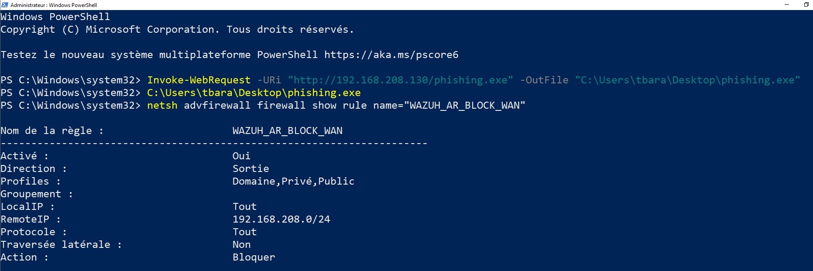

# Réponse active

## Mécanisme utilisé : Integration Wazuh + script Python (SSH)

Contrairement à un déploiement Wazuh classique, la réponse active n'utilise pas le mécanisme natif Active Response de Wazuh (`<active-response>`/`<command>`, exécuté par `wazuh-execd`). Ce mécanisme natif a été testé de manière approfondie mais n'a jamais fonctionné de bout en bout sur cet agent Windows — voir la section "Pourquoi le mécanisme natif a été abandonné" plus bas et [troubleshooting.md](troubleshooting.md) pour le détail complet du débogage.

Le mécanisme réellement actif repose sur le bloc `<integration>` de Wazuh (normalement prévu pour envoyer des alertes vers un système tiers, ici détourné pour déclencher une action) :

```
Alerte Wazuh (100501 ou 100201) → integration → custom-response.py (Wazuh Server) → SSH/Paramiko → Windows 10 → block-wan-remote.ps1
```

### Configuration Wazuh (`ossec.conf`, bloc `<integration>`)

```xml
<integration>
  <name>custom-response</name>
  <hook_url>192.168.30.10</hook_url>
  <api_key><utilisateur>|<mot_de_passe></api_key>
  <rule_id>100501,100201</rule_id>
  <alert_format>json</alert_format>
</integration>
```

Ce bloc détourne deux champs prévus pour un usage différent : `hook_url` porte l'IP de la cible SSH (Windows 10) plutôt qu'une URL de webhook, et `api_key` porte les identifiants Windows au format `utilisateur|mot_de_passe` plutôt qu'une clé d'API. Les identifiants réels sont remplacés ici par un placeholder ; voir la note de sécurité en fin de fichier.

Fichier complet (les deux blocs `<integration>`) : [`configs/ossec-integrations.xml`](../configs/ossec-integrations.xml)

Ce bloc est volontairement commenté par défaut dans `ossec.conf`. Pour dérouler le scénario d'attaque complet sans déclenchement de blocage (utile pour observer une session Meterpreter stable, par exemple), il suffit de le laisser en commentaire. Pour tester la réponse active, on le décommente puis on redémarre le manager (`sudo systemctl restart wazuh-manager`) avant de relancer le scénario.

### Script d'intégration (`custom-response`, Python, exécuté sur le Wazuh Server)

Reçoit l'alerte JSON en argument, se connecte en SSH à Windows 10 via Paramiko, puis lance le script de blocage à distance.

```python
#!/usr/bin/env python3
import sys
import json
import paramiko

alert_file = sys.argv[1]
creds = sys.argv[2]        # format : "utilisateur|motdepasse"
target_ip = sys.argv[3]    # IP de Windows

user, password = creds.split("|")

with open(alert_file) as f:
    lines = [l for l in f.read().splitlines() if l.strip()]
alert = json.loads(lines[0])

client = paramiko.SSHClient()
client.set_missing_host_key_policy(paramiko.AutoAddPolicy())
client.connect(target_ip, username=user, password=password, timeout=10)

cmd = 'powershell.exe -NoProfile -ExecutionPolicy Bypass -File "C:\\Program Files (x86)\\ossec-agent\\active-response\\bin\\block-wan-remote.ps1"'
stdin, stdout, stderr = client.exec_command(cmd)
stdout.channel.recv_exit_status()
client.close()
```

Le script se connecte via le serveur OpenSSH natif de Windows 10 (activé pour ce besoin), avec les mêmes identifiants que ceux fournis dans le bloc `<integration>`.

Fichier complet : [`scripts/custom-response`](../scripts/custom-response)

### Script de blocage (`block-wan-remote.ps1`, exécuté à distance sur Windows 10)

```powershell
$logFile = "C:\Program Files (x86)\ossec-agent\active-response\bin\debug-block-wan-remote.log"
Add-Content -Path $logFile -Value "$(Get-Date) - Declenchement via SSH"

netsh advfirewall firewall add rule name="WAZUH_AR_BLOCK_WAN" dir=out action=block remoteip=192.168.208.0/24 | Out-Null
netsh advfirewall firewall add rule name="WAZUH_AR_BLOCK_WAN_IN" dir=in action=block remoteip=192.168.208.0/24 | Out-Null
Stop-Process -Name phishing -Force -ErrorAction SilentlyContinue
Add-Content -Path $logFile -Value "$(Get-Date) - Blocage applique"

# Revert automatique apres 5 minutes, pour reproduire le comportement timeout=300 qu'on avait avec l'AR native
$revertScript = @'
netsh advfirewall firewall delete rule name="WAZUH_AR_BLOCK_WAN"
netsh advfirewall firewall delete rule name="WAZUH_AR_BLOCK_WAN_IN"
'@
$revertScript | Out-File -FilePath "$env:TEMP\revert-block-wan.ps1" -Encoding ASCII
schtasks /Create /TN "RevertBlockWan" /TR "powershell.exe -NoProfile -ExecutionPolicy Bypass -File $env:TEMP\revert-block-wan.ps1" /SC ONCE /ST (Get-Date).AddMinutes(5).ToString("HH:mm") /F | Out-Null
Add-Content -Path $logFile -Value "$(Get-Date) - Tache de revert planifiee"
```

Fichier complet : [`scripts/block-wan-remote.ps1`](../scripts/block-wan-remote.ps1)

Le script bloque tout le sous-réseau WAN utilisé par Kali (192.168.208.0/24) en entrée et en sortie, tue le processus `phishing.exe` s'il tourne encore, puis planifie une tâche Windows (`schtasks`) pour lever le blocage automatiquement après 5 minutes — reproduisant le comportement `timeout=300` qu'aurait eu l'Active Response native.



## Pourquoi le mécanisme natif a été abandonné

Une implémentation avec l'Active Response native de Wazuh (bloc `<active-response>`/`<command>`, `location: local`, script `block-wan.cmd`/`.ps1` exécuté par `wazuh-execd` sur l'agent Windows) a d'abord été mise en place et longuement déboguée :

- Un premier bug a été identifié et corrigé : le processus agent Windows tournait avec une définition `ar.conf` obsolète en mémoire (chargée avant la synchronisation de la commande `block-wan`), résolu par un redémarrage complet du service `WazuhSvc`.
- Un second bug est apparu ensuite : le script `.cmd` d'origine utilisait une boucle `for /f ... in ('more')` pour lire le JSON depuis `stdin`, qui restait bloquée indéfiniment sans jamais recevoir de fin de flux propre. Corrigé en réécrivant le script en PowerShell (lecture via `[Console]::In.ReadToEnd()`), plus fiable pour le parsing JSON.
- Malgré ces deux corrections confirmées individuellement (le script fonctionne parfaitement quand on l'invoque manuellement avec le même JSON qu'enverrait Wazuh), le déclenchement automatique par `wazuh-execd` sur l'agent Windows n'a jamais fonctionné : le manager confirme l'envoi de la commande (log `AR_Forward` côté manager, testé aussi bien via une vraie alerte que via un déclenchement manuel avec `agent_control -f`), l'agent Windows est bien connecté et actif, mais aucune trace de réception ni d'exécution n'apparaît côté agent, même avec le niveau de debug maximal (`execd.debug=2`) — silence complet, sans erreur exploitable.

Ce comportement correspond à des rapports similaires, non résolus, concernant l'Active Response native en `location: local` sur agent Windows dans certaines versions de Wazuh. Plutôt que de continuer à déboguer un mécanisme interne sans log exploitable, la décision a été prise de changer le déclencheur (comment la réponse est invoquée) tout en réutilisant les composants déjà validés individuellement (le script de blocage, fonctionnel à 100 % en exécution manuelle) : le pivot vers une invocation SSH/Paramiko depuis un script d'intégration, décrit plus haut, qui contourne entièrement `wazuh-execd` côté agent.

Le détail complet de cette séquence de débogage (logs, commandes de diagnostic, hypothèses écartées une à une) est conservé dans [troubleshooting.md](troubleshooting.md).

## Sécurité

Les identifiants Windows utilisés par `custom-response.py` (et transmis en clair dans `<api_key>` faute de mécanisme de secret dédié dans Wazuh) ne doivent jamais apparaître en clair dans ce dépôt public. Le bloc `<integration>` ci-dessus est donné avec un placeholder ; le fichier `ossec.conf` réel, sur la machine, contient les vrais identifiants.